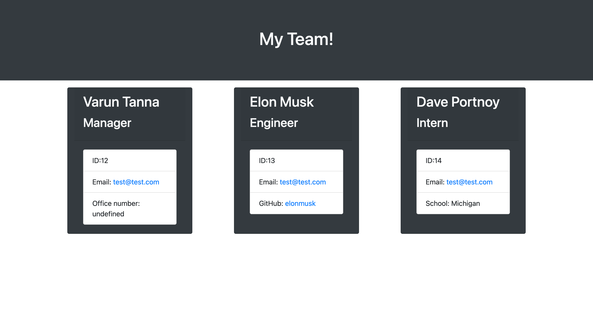

# team-profile-generator

# Description
The user is building a Team Profile Generator to showcase different roles and imformation aobout their employees. Once the user inputs all of their data it is generated into an HTML and displays each team members specific information.

# Usage
-   The user starts by initializing the command line by using      "node index.js".
- Then the user is presented with a list of questions for their manager postion.
- The user inputs the proper data for the manager and then is promted with with other emplyoee they would want to add to their team. 
- After the user fills out all the needed team memebers they can simply arrow down to the DONE option and then a HTML will generate for them with the information that they input.

## Acceptance Criteria
GIVEN a command-line application that accepts user input
WHEN I am prompted for my team members and their information
THEN an HTML file is generated that displays a nicely formatted team roster based on user input
WHEN I click on an email address in the HTML
THEN my default email program opens and populates the TO field of the email with the address
WHEN I click on the GitHub username
THEN that GitHub profile opens in a new tab
WHEN I start the application
THEN I am prompted to enter the team manager’s name, employee ID, email address, and office number
WHEN I enter the team manager’s name, employee ID, email address, and office number
THEN I am presented with a menu with the option to add an engineer or an intern or to finish building my team
WHEN I select the engineer option
THEN I am prompted to enter the engineer’s name, ID, email, and GitHub username, and I am taken back to the menu
WHEN I select the intern option
THEN I am prompted to enter the intern’s name, ID, email, and school, and I am taken back to the menu
WHEN I decide to finish building my team
THEN I exit the application, and the HTML is generated

## Links

